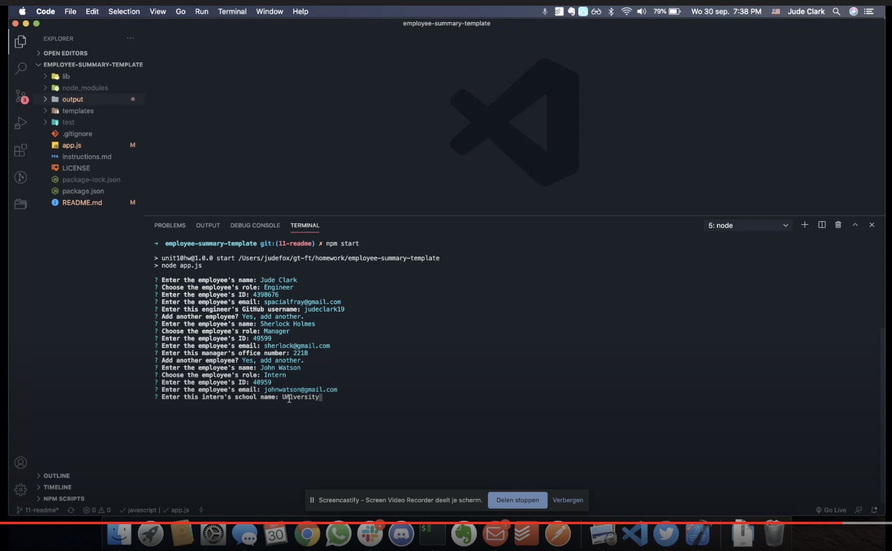

# Employee Summary Generator (Template)

## Description
This node.js app will generate a stylish HTML page on which to display basic contact information about your coworkers/employees. Simply fill in employee data via the command line and the app will take that and inject it into an HTML page that you can then use as you wish.

### Example of a generated page

***

## Installation and Usage

### Demonstration video

### Written Instructions

    1. You must already have node.js installed to run this app.
    2. Clone the repository
    3. Run "npm i" or "npm install" to install inquirer.
    4. Run "npm start" to start the application.
    5. Follow the prompts in the command line (watch the video above for a demo).

## License
